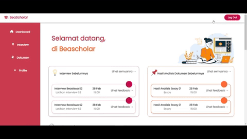

# BeaScholar Web App

## Overview
BeaScholar is a comprehensive web application dedicated to assisting students in their pursuit of scholarships. Designed to streamline the entire scholarship search and application process, BeaScholar offers tools for discovering scholarships, preparing for interviews, and reviewing crucial documents like essays and CVs.

## Demo Video
Watch our demo video to see BeaScholar in action: [BeaScholar Demo Video](https://www.youtube.com/watch?v=K63vh7QgksY)

## Features
- **1. Scholarship Search**: Utilize an advanced search engine to find scholarships that match your academic interests and career aspirations.
- **2. Interview Preparation**: Schedule one-on-one practice sessions with experts to prepare for scholarship interviews. Gain insights and feedback to enhance your performance.
- **3. Document Review by Expert**: Opt for expert-driven reviews for a thorough critique of your essays and CVs.
- **4. Document Review by AI**: Get instant feedback with our AI-driven review tool, ensuring your documents are polished and compelling.

## Screenshots & GIFs
-  
-  *Above is the demonstration of search feature within BeaScholar.*

## Usage
- **Sign Up/Login**: Register for a new account or log into your existing account.
- **Scholarship Search**: Use our search tools to find and apply for scholarships.
- **Interview Preparation**: Schedule and participate in mock interviews with experts to prepare effectively for your scholarship interviews.
- **Document Review**: Choose between human expert reviews and instant AI-assisted review and get feedback for your essays and CVs.

## Tech Stack
- **Frontend**: React JSX
- **Backend**: Go, Firebase Firestore, Firebase Storage

## Group Members
1. Raymond Akkasel Jaya Imanuel (2602128094)
2. Alves Renato Sennellius (2602130666)
3. Fanes Liu (2602107663)
4. Valentcia Angelica (2602101514)
5. Julio (2602118181)
